# Books
Books for programation [ALL BOOKS](https://drive.google.com/drive/folders/1FhIBhAuUt8bOHAA5Ng2FPW-V_1hgmr73?usp=drive_link)  

Algoritmos, Thomas H. Cormen

  

Banco de Dados, Sandra Puga

  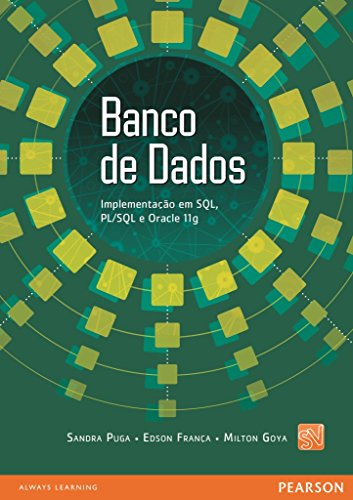

Clean Code, Robert Cecil Martin

  

Design Patterns, Erich Gamma

  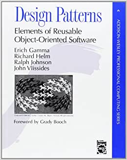

Estrutura de Dados e Seus Algoritimos 3a, Szwarcfiter J.L

  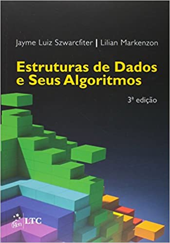

Fundamentos da Programacao de computadores 3a, Ascencio A.F.G

  

Java Efetivo: as melhores praticas para a plataforma Java 3a, joshua Bloch

  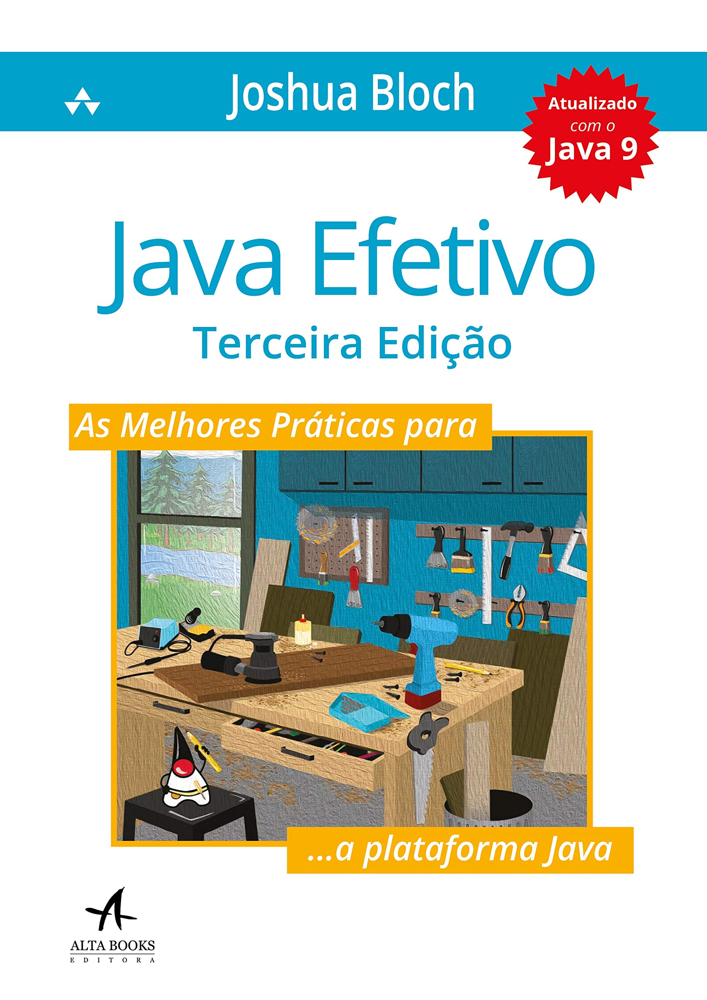

Java: Guia do Programador, Peter Jandl

  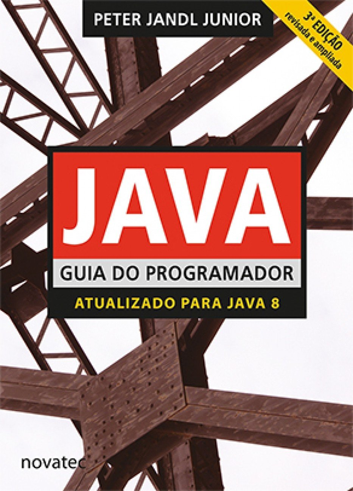

Logica de Programacao: A construcao de Algoritimos e Estrutura de Dados 3a, Forbellone A.L.V

  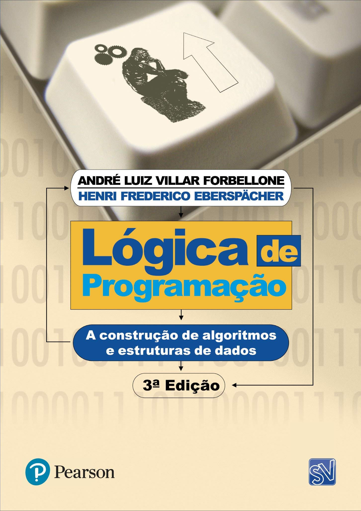

Logica de Programacao Algoritimica, Guedes S.

  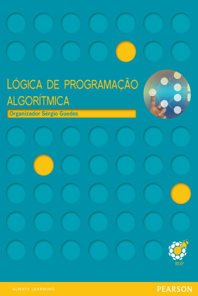

Hands-On Machine Learning, Aurélien Geron

  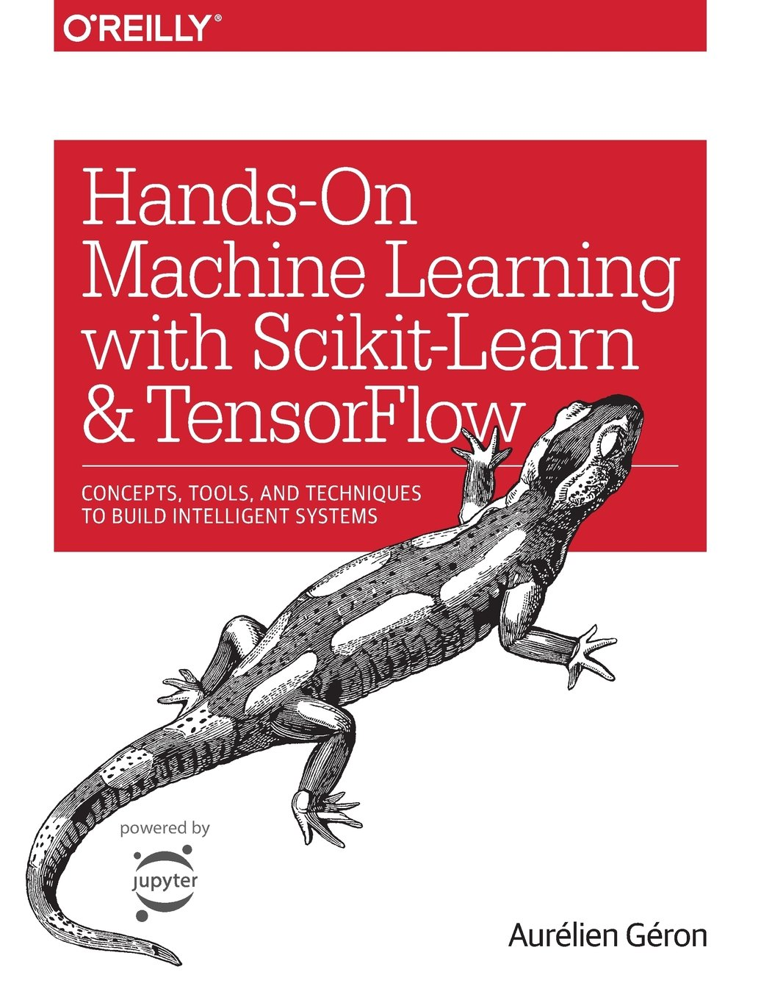

Logica de Programacao e Estrutura de Dados com Aplicacoes java 2a, Sandra Puga

  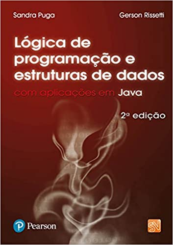

Programação em Python: Fundamentos e Resolução de Problemas, Hernesto Costa

  

Projeto de Banco de Dados, Carlos alberto Heuser

  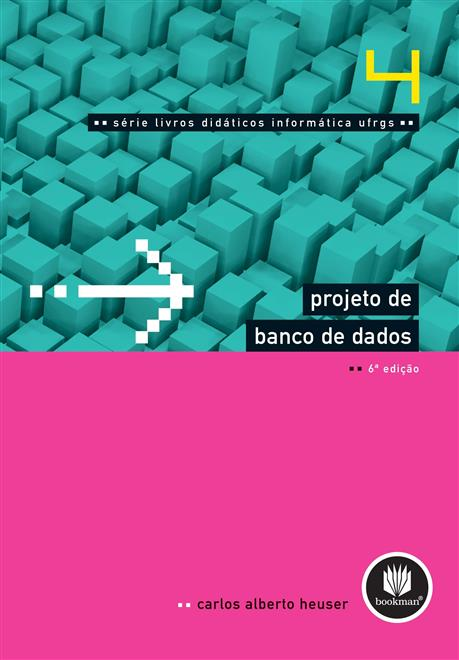

Python: 3 Manuscripts in 1 book - Python Programing For (Beginners, Intermediates, Advanced), Kindle

  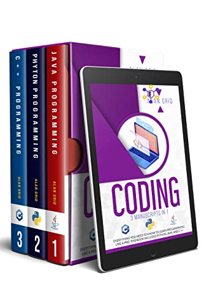

Python Programming For Begginers: Learn The Basics Of Python Programing, Kindle

  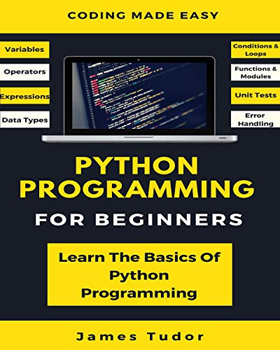

Programacao de Computadores, Leme E. S.

  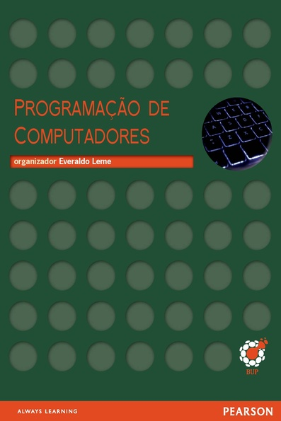

Refatoração, Kent Beck
 

  

Sistemas Orientados a Objetos: Teoria e Pratica com UML e Java 1a, Pablo Rangel
 

  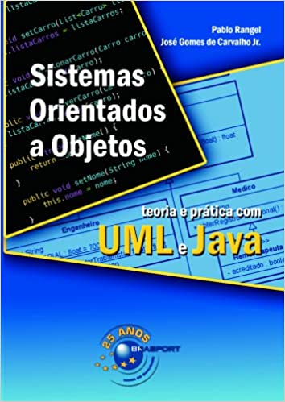

The Complete Reference 7a, Schildt
 

  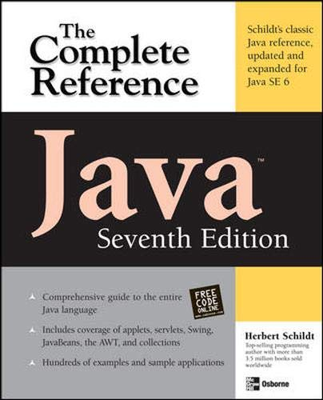

